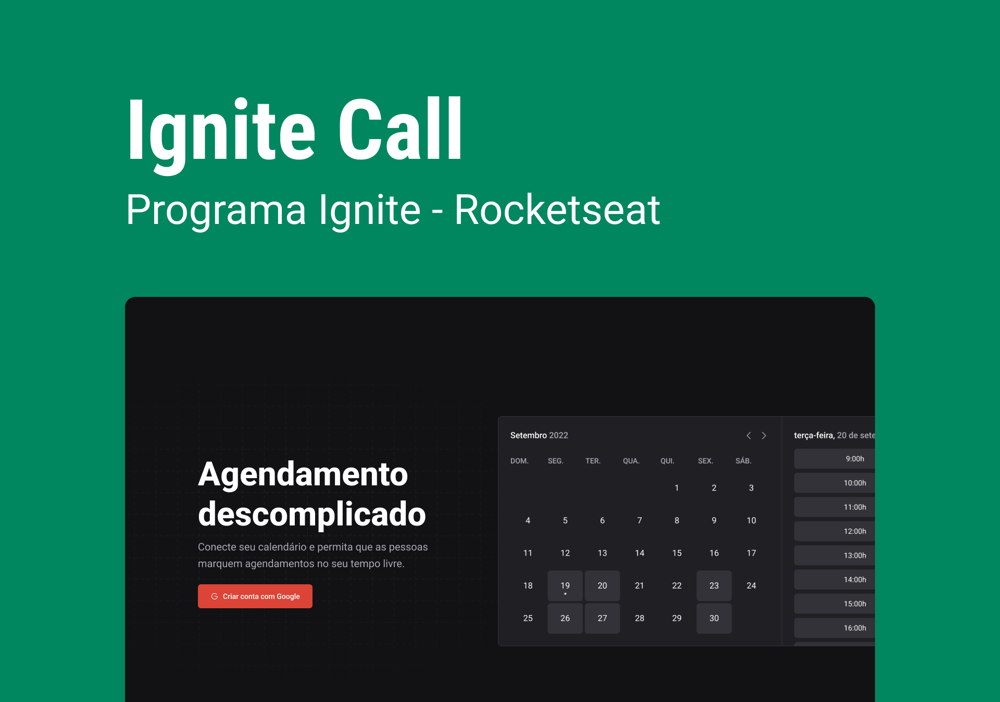

<p align="center">
  
</p>

## **💻** Projeto

Um sistema inteiro de agendamento da sua forma… quem nunca imaginou isso? Como desenvolvedor, uma das maiores dificuldades é a criação de uma sistema inteiro de agendamento “na mão”, criando inclusive o calendário inteiro e toda a sua lógica… 

A fim de consolidar ainda mais meus conhecimentos sendo alinhado com as novas e melhores práticas e tecnologias disponíveis no mundo da tecnologia, desenvolvi uma aplicação FULLSTACK durante o programa de aceleração “Ignite - ReactJS”, promovido pela Rocketseat, onde contruímos um sistema de agendamento completo, utilizando o design system criando anteriormente, integrando-o ao Google Calendar, com deploy do banco de dados em PlanetScale.    

<p align="center">
  
</p>

## Tecnologias utilizadas

- [Design System próprio](http://srsouzaj.github.io/05-designSystem/)
- [Typescript](https://www.typescriptlang.org/)
- [ReactJS](https://pt-br.reactjs.org/)
- [NextJS](https://nextjs.org/)
- [Eslint](https://eslint.org/)
- [Axios](https://axios-http.com/ptbr/docs/intro)
- [react-query](https://tanstack.com/query/v3/)
- [nookies](https://www.npmjs.com/package/nookies)
- [dayjs](https://day.js.org/)
- [phosphor-react](https://phosphoricons.com/)
- [next-auth](https://next-auth.js.org/)
- [next-seo](https://github.com/garmeeh/next-seo)
- [docker for db](https://docs.docker.com/desktop/install/windows-install/)
- [googleapis](https://www.npmjs.com/package/googleapis)
- [prisma](https://www.prisma.io/)
- [react-hook-form](https://react-hook-form.com/)
- [Zod](https://github.com/colinhacks/zod)

## **🔖 Deploy e Layout**

Você pode visualizar o deploy do sistema em funcionamento, bem como o layout utilizado através dos links abaixo:

- [Deploy](http://ignitecalls.vercel.app)
- [Layout](https://www.figma.com/community/file/1161274296921389678)

## **🚀** Como Executar

Antes de baixar o projeto você vai precisar ter instalado na sua máquina as seguintes ferramentas:

- [Git](https://git-scm.com/)
- [NodeJS](https://nodejs.org/en/)
- [NPM](https://www.npmjs.com/)

Segue os comandos para baixar e executar o projeto na sua máquina:

```bash
## Clone o projeto em sua máquina
git clone [https://github.com/srsouzaj/](https://github.com/srsouzaj/nlwsetup)06-ignite-call.git

# Acessar o projeto no terminal
$ cd 06-ignite-call

# Instalar as dependências
$ npm install

# Após setar todas as variáveis de ambiente
# executar o servidor em modo de desenvolvimento
$ npm run dev

# CAso queira ver os dados inseriros, executar o seguinte comando
$ npx prisma studio
```

## 📝 License

Esse projeto está sob a licença MIT. Veja o arquivo [LICENSE](https://github.com/srsouzaj/06-ignite-call/blob/master/LICENSE.md) para mais detalhes.

Feito com ❤️ por Jorge de Souza
